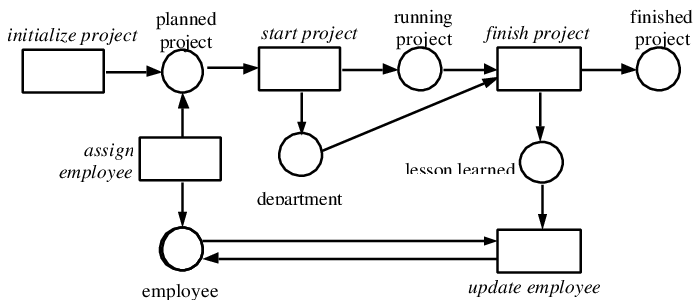

======================================================================================
Welcome to Anti-Alignments for Measuring Precision and Generalization's documentation!
======================================================================================
In this project, we implement a novel approach based on the paper `“A Unified Approach for Measuring Precision and Generalization based on Anti-alignments,” <https://hal.archives-ouvertes.fr/hal-01406850>`_
written by B.F. van Dongen et. al. The approach aims to provide a better estimation of precision and generalization by using ​anti-alignments​.
An anti-alignment is a run of a model that deviates
as much as possible from any trace contained in the corresponding event log.

What is Process Mining?
#######################
Process mining is to gain insights into the behavior of operational information systems by analyzing event logs,it is an analytical discipline for discovering, 
monitoring, and improving real processes (i.e., not assumed processes) by extracting knowledge from event logs readily available in today’s information systems.
it offers objective, fact-based insights, derived from actual event logs, that help you audit, analyze, 
and improve your existing business processes by answering both compliance-related and performance-related questions.
Below figure is an example for describing an observed behavior of a project execution process in a form of an (executable) process model, visualized by petri-net.

.. centered:: Fig 1: Simple Petri net for the process of project execution

Why Conformance Checking?
#########################
There has been always a discussion on how to interpret process discovery results, i.e. how does the produced model relate to the actual, but unknown, system
in four quality dimensions:

* **Fitness :** quantifies how much of the observed behavior is captured by the model,
* **Generalization :** quantifies how well the model explains unobserved system behavior,
* **Precision :** quantifies how much behavior exists in the model that was not observed, and
* **Simplicity :** quantifies the complexity of the model.

How our Project Related?
########################
The focus of this project is not on fitness nor simplicity, as we assume our models to be perfectly fitting by preprocessing the log and removing the unfitted logs.
Based on the paper and in this implementation, we take a fresh look at precision and generalization by using the concept of an anti-alignment.
An anti-alignment of a model with respect to a log is an execution of a model which is as different as possible from the observed log.
We instruct and adapt cross-validation-based techniques in combination with anti-alignments
to derive solid metrics that show a better estimation with respect to the state-of-the-art metrics

Contents
########

.. toctree::
   :maxdepth: 2
   :numbered:
   :titlesonly:

	Getting Started <GettingStrated.rst>
	License <LICENSE.rst>
	Help! <Help.rst>
	
	
Indices and tables
==================

* :ref:`genindex`
* :ref:`modindex`
* :ref:`search`
